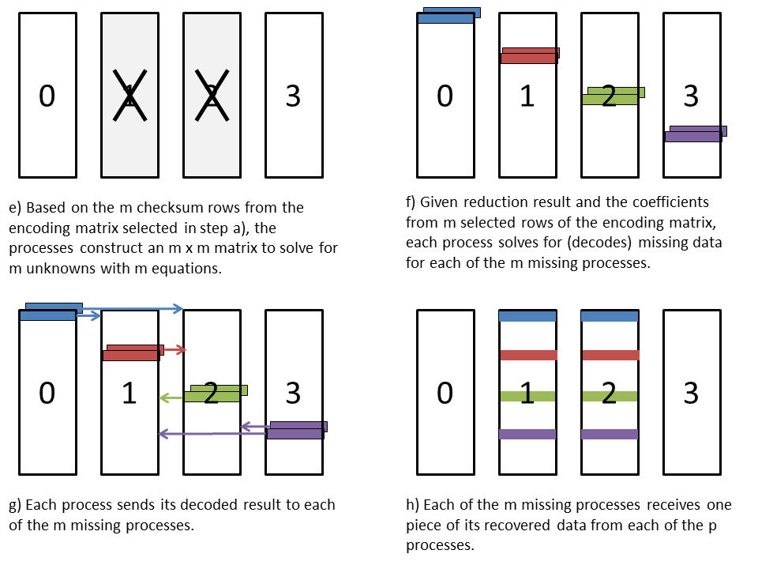

Redundancy schemes
==================

SINGLE
++++++
With the SINGLE redundancy scheme,
redset keeps a single copy of each file.
It tracks meta data for application files,
but no redundancy data are stored.
The communicator in the redundancy descriptor
is a duplicate of MPI_COMM_SELF.

The lack of data redundancy prevents SINGLE
from recovering data in cases where access to storage is lost,
though many failures in practice do not impact storage accessibility.
This scheme is also effective when writing to storage that is highly reliable.

A descriptor is stored as a kvtree in the header of a redundancy file for SINGLE,
which records meta data about the files written by the calling process.

An example of the header in a SINGLE redundancy file is shown below::

  DESC
    0
      DESC
        ENABLED = 1
        GROUP = 0
        GROUPS = 4
        RANK = 0
        RANKS = 1
        TYPE = SINGLE
        WRANK = 0
        WRANKS = 4
      FILE
        0
          ./testfile_0.out
            ATIME_NSECS = 924124298
            ATIME_SECS = 1596606911
            CTIME_NSECS = 918124338
            CTIME_SECS = 1596606911
            GID = 12345
            MODE = 33152
            MTIME_NSECS = 918124338
            MTIME_SECS = 1596606911
            SIZE = 4194304
            UID = 12345
      FILES = 1
  RANK = 0

The topmost DESC section lists the file meta data for the owning process.
Entries in this section are indexed by rank within the redundancy group.
For SINGLE, this section will only contain information for the local process.

The DESC section under that provides details about the redundancy scheme and the redundancy set.
It lists the scheme in TYPE.
GROUPS specifies the number of redundancy groups.
GROUP specifies the group id that the process belongs to,
RANKS specifies the size of that group,
and RANK specifies the rank of the process within the group.
WRANKS gives the global number of ranks,
and WRANK records the global rank of the process.

Meta data about the files is shown after that.
For a given process, the number of files that process wrote is listed under FILES
and a ordered list of meta data for each file under the FILE kvtree.
Each file is assigned an integer index, counting up from 0,
which specifies the order in which the files were given in ``redset_apply``.
The meta data for each file is then recorded under the filename,
which includes the file size and other information like timestamps and permissions encoded from a stat call.

The topmost RANK key gives the rank of the process within its redundancy set.
Each redundancy set in SINGLE consists of one rank.

The SINGLE redundancy file is named of the form::

  <prefix><rank>.single.grp_<group_id>_of_<group_num>.mem_<group_rank>_of_<group_size>.redset

PARTNER
+++++++
With PARTNER, full replicas of all source files from the calling process are copied to other processes.
The number of replicas is defined by the caller,
but it must be at least one and at most one less than the number of processes in the redundancy set.
Partner processes are selected from different failure groups than the calling process,
so that it is unlikely for a process and each of its partners to fail at the same time.

When creating the redundancy descriptor,
redset splits the parent communicator into subcommunicators
each of which contains at most one process from each failure group.
Within this communicator, each process sends its files to processes wit higher ranks,
and each process stores the replicas of files for processes having lower ranks.
Processes at the end of the communicator wrap back to the beginning.

The meta data for each source file is transferred and stored in addition to the file data.
The meta data is stored in a kvtree in the header of the PARTNER redundancy file,
and file data are appended after the header as binary data.
All data for the partner to the immediate left is stored first,
followed by all data for the next partner to the left and so on.

An example of the header kvtree in a PARTNER redundancy file is shown below::

  DESC
    0
      DESC
        ENABLED = 1
        GROUP = 0
        GROUPS = 1
        RANK = 0
        RANKS = 4
        REPLICAS = 2
        TYPE = PARTNER
        WRANK = 0
        WRANKS = 4
      FILE
        0
          ./testfile_0.out
            ATIME_NSECS = 488905501
            ATIME_SECS = 1596608041
            CTIME_NSECS = 484905527
            CTIME_SECS = 1596608041
            GID = 12345
            MODE = 33152
            MTIME_NSECS = 484905527
            MTIME_SECS = 1596608041
            SIZE = 4194304
            UID = 12345
      FILES = 1
    3
      DESC
        ENABLED = 1
        GROUP = 0
        GROUPS = 1
        RANK = 3
        RANKS = 4
        REPLICAS = 2
        TYPE = PARTNER
        WRANK = 3
        WRANKS = 4
      FILE
        0
          ./testfile_3.out
            ATIME_NSECS = 494674123
            ATIME_SECS = 1596608041
            CTIME_NSECS = 486674153
            CTIME_SECS = 1596608041
            GID = 12345
            MODE = 33152
            MTIME_NSECS = 486674153
            MTIME_SECS = 1596608041
            SIZE = 7340032
            UID = 12345
      FILES = 1
  RANK = 0

The topmost DESC section records file meta data for the calling process and
for each process for which it stores partner copies.
This meta data is indexed by the rank of each process within its redundancy group.

The DESC section for each process is similar to SINGLE, except for an added REPLICAS field to record the number of PARTNER replicas.

The file meta data for each process is listed as described for SINGLE.

As with SINGLE, a topmost RANK entry in the header records the rank of the process within its redundancy set.

The partner file is named of the form::

  <prefix><rank>.partner.grp_<group_id>_of_<group_num>.mem_<group_rank>_of_<group_size>.redset

XOR
+++
The XOR redundancy scheme divides the processes into sets.
Each process in a set computes and stores redundancy data in an XOR redundancy file.

The XOR redundancy scheme can recover all files for any single member of a set.
If any set loses files for two or more processes,
the XOR redundancy scheme cannot recover all files.

The processes within each set are ordered,
and each process has a rank in the set, counting up from 0.
The process whose rank in the set is one less than the rank of the current process is called the left neighbor,
and the process whose rank is one more is the right neighbor.
The last rank wraps back to the first to form a ring.
At run time, the library caches the XOR set in the MPI communicator associated with a redundancy descriptor.
Each process also caches information about its left and right neighbor processes in the redundancy descriptor.

XOR algorithm
-------------
The XOR redundancy scheme applies the algorithm described in [Gropp]_ (which implements RAID-5 from [Patterson]_).
Assuming that each process writes one file and that the files on all processes are the same size,
this algorithm is illustrated in Figure fig-xor_.
Given N processes in the set, each file is logically partitioned into N-1 chunks,
and an empty, zero-padded chunk is logically inserted into the file at alternating
positions depending on the rank of the process.
A reduce-scatter is computed across the set of logical files using a byte-wise XOR operation.
The resulting chunk from this reduce-scatter is the data that the process stores in its redundancy file.

.. _fig-xor:

.. figure:: fig/xor.png

.. XOR Reduce Scatter

In general, each process in the set may write a different number of files,
and the size of each file may be arbitrary.
Figure fig-xor-general_ illustrates how to extend the algorithm to this general case.
First, all files from a process are logically concatenated into a single file.
The minimum chunk size is then computed such that N-1 chunks are equal to or larger than the largest logical file in the set.
Finally, the end of each logical file is padded with zero bytes
so that each logical file extends to the number of bytes contained in N-1 chunks.
This method is most efficient when all processes write the same amount of data.

.. _fig-xor-general:

.. figure:: fig/xor_general.png

.. Extension to multiple files

The redset implementation internally uses an abstraction called redset_lofi (logical file)
that treats an ordered set of physical files as a single logical file.
This abstraction implements open, read, write, and close functions to operate on a logical file.
To read from this logical file, redset_lofi calls redset_read_pad_n()
which takes input arrays of file names, file sizes, and opened file descriptors for each physical file,
as well as an offset and the number of bytes to read.
It returns data as though the set of physical files are concatenated as a
single file in the order given by the input arrays.
The read operation also pads the end of the logical file with zero bytes
if the read extends past the amount of physical data.
There is a corresponding redset_write_pad_n() function to write to a logical file.
These functions are implemented in redset_lofi.c.

Thus redset operates as though each process has exactly one file
where each file has the same length and is evenly divisible by N-1.
The reduce-scatter implementation achieves the following goals:
  - Evenly distribute work among all processes in the set.
  - Structure communication so that a process always receives data from its immediate left neighbor and sends data to its immediate right neighbor to reduce network contention.
  - Read data from each file once and write data to each XOR redundancy file once to minimize file accesses.
  - Operate on the data in small pieces so that the working set fits within the processor cache.

To accomplish this, each chunk is divided into a series of smaller pieces, and the pieces are operated on in phases.
The reduce-scatter result is computed for the first piece across all chunks and then written to the redundancy file.
Then the reduce-scatter result is computed for the second piece across all chunks, and so on.
In each phase, the reduce-scatter computation is pipelined among the processes.
The first phase of this reduce-scatter algorithm is illustrated in Figure fig-reduce-scatter_.
This algorithm is implemented in redset_apply_xor() in redset_xor.c.

.. _fig-reduce-scatter:

.. figure:: fig/reduce_scatter.png

.. Pipelined XOR reduce-scatter implementation

XOR file
--------
The XOR redundancy file contains a header stored as a kvtree
followed by the XOR chunk data stored as binary data.
The header provides file information for the calling process
and the group of processes that belong to its XOR set.
A copy of the meta data for a process's files is also stored
in the header of the XOR file written by the process's right neighbor.

An example header is shown below::

  CHUNK = 2446678
  DESC
    0
      DESC
        ENABLED = 1
        GROUP = 0
        GROUPS = 1
        RANK = 0
        RANKS = 4
        TYPE = XOR
        WRANK = 0
        WRANKS = 4
      FILE
        0
          ./testfile_0.out
            ATIME_NSECS = 510882
            ATIME_SECS = 1596609195
            CTIME_NSECS = 995510916
            CTIME_SECS = 1596609194
            GID = 12345
            MODE = 33152
            MTIME_NSECS = 995510916
            MTIME_SECS = 1596609194
            SIZE = 4194304
            UID = 12345
      FILES = 1
    3
      DESC
        ENABLED = 1
        GROUP = 0
        GROUPS = 1
        RANK = 3
        RANKS = 4
        TYPE = XOR
        WRANK = 3
        WRANKS = 4
      FILE
        0
          ./testfile_3.out
            ATIME_NSECS = 2659263
            ATIME_SECS = 1596609195
            CTIME_NSECS = 994659293
            CTIME_SECS = 1596609194
            GID = 12345
            MODE = 33152
            MTIME_NSECS = 994659293
            MTIME_SECS = 1596609194
            SIZE = 7340032
            UID = 12345
      FILES = 1
  GROUP
    RANK
      0 = 0
      1 = 1
      2 = 2
      3 = 3
    RANKS = 4
  RANK = 0

The size of the XOR chunk in number of bytes is specified in the CHUNK field.

The topmost DESC section provides the file meta data for the calling process and its left neighbor.
These are indexed by the rank of each process within its redundancy group.
This is used similarly as described for the corresponding section in SINGLE.

The GROUP kvtree records the set of processes in the redundancy set.
The number of processes in the set is listed under the RANKS field,
and a mapping of a process's rank within its group to its global rank within the parent communicator is stored under the RANK kvtree.

The topmost RANK field records the rank of the calling process within its group.

The XOR redundancy file name is of the form::

  <prefix><rank>.xor.grp_<group_id>_of_<group_num>.mem_<group_rank>_of_<group_size>.redset

XOR rebuild
-----------
During a rebuild, the processes in each set check whether there are missing files, and if so, whether they can be rebuilt.
If any set determines that files cannot be recovered, the rebuild operation fails.
If a rebuild is needed and is possible, the processes identify the rank in the set that needs to rebuild its files.
The redset library implements an XOR reduction algorithm that achieves the same goals
as the reduce-scatter described earlier.
Namely, the implementation attempts to distribute work evenly among all processes,
minimize network contention, and minimize file accesses.
This algorithm is implemented in redset_recover_xor() in redset_xor.c.
An example is illustrated in Figure fig-xor-reduce_.

.. _fig-xor-reduce:

.. figure:: fig/xor_reduce.png

.. Pipelined XOR reduction to root

.. [Gropp] "Providing Efficient I/O Redundancy in MPI Environments", William Gropp, Robert Ross, and Neill Miller, Lecture Notes in Computer Science, 3241:7786, September 2004. 11th European PVM/MPI Users Group Meeting, 2004.

.. [Patterson] "A Case for Redundant Arrays of Inexpensive Disks (RAID)", D Patterson, G Gibson, and R Katz, Proc. of 1988 ACM SIGMOD Conf. on Management of Data, 1988.

Reed-Solomon
++++++++++++
The RS redundancy scheme applies a Reed-Solomon encoding across the files of the redundancy set.
It can recover up to ``k`` failures in the group.
In the description below, assume:

- ``p`` processes per redundancy set
- ``B`` bytes per process
- ``k`` encoding blocks, where ``1 <= k < p``
- ``m`` failures, where ``m <= k``

The implementation uses Galois Fields of 2^8,
which requires that ``(p + k) <= 256``.
Some useful references for understanding Reed-Solomon encoding and arithmetic with Galois Fields:

- `An Introduction to Galois Fields and Reed-Solomon Coding <https://people.cs.clemson.edu/~westall/851/rs-code.pdf>`_
- `A Tutorial on Reed-Solomon Coding for Fault-Tolerance in RAID-like Systems <http://web.eecs.utk.edu/~jplank/plank/papers/CS-96-332.pdf>`_
- `Note: Correction to the 1997 Tutorial on Reed-Solomon Coding <http://web.eecs.utk.edu/~jplank/plank/papers/CS-03-504.pdf>`_

In short, a ``(p + k) x p`` encoding matrix is constructed, where the top ``p x p`` portion is an identity matrix,
and the bottom ``k`` rows give the encoding coefficients for each of the ``k`` checksum blocks.
This matrix is constructed such that any ``p`` rows are linearly independent.
For example, an example encoding matrix for 4 processes and 2 checksums is::

  1  0  0  0
  0  1  0  0
  0  0  1  0
  0  0  0  1
  27 28 18 20
  28 27 20 18

Define this encoding matrix as ``E``.
A word of data taken from each of the ``p`` processes defines a data vector ``d``.
The matrix-vector product ``Ed`` produces an output vector of length ``p + k``,
where the first ``p`` elements are equal to the data vector ``d``,
and the last ``k`` elements are the encoded checksum values.
Keeping with the above example, there are two checksum values, which are computed as::

  c0 = (27 * d0) + (28 * d1) + (18 * d2) + (20 * d3)
  c1 = (28 * d0) + (27 * d1) + (20 * d2) + (18 * d3)

where ``d0``, ``d1``, ``d2``, and ``d3`` are each a word of data from each of the four processes,
and ``c0`` and ``c1`` are each a word of encoded checksum data.

To decode, the ``m`` missing processes are first identified.
Then one chooses any ``m`` distinct rows from the encoding matrix which gives ``m`` equations for ``m`` unknowns.
For each selected row, the coefficients of the columns corresponding to the ``m`` missing processes define an ``m x m`` matrix,
which is reduced to an ``m x m`` identity matrix via Gaussian elimination to recover the missing data.

A critical detail is that all arithmetic is under a Galois Field, in particular GF(2^8).
For GF(2^8), all operations are executed in units of bytes.
Addition and subtraction amount to performing binary XOR operations.
Multiplication and division of two elements is accomplished through table look ups.
It holds that for any value ``a``, ``a+0 = a``, ``a*0 = 0``, and ``a*1 = a``.
Under this arithmetic, matrix operations including matrix-vector multiplication
and Gaussian elimination follow the normal rules of linear algebra.

RS encode
---------
The RS algorithm is an extension of the approach described for XOR,
where each process stores ``k`` encoding chunks instead of 1 XOR chunk.
As with the XOR scheme, Reed-Solomon concatenates and pads logical files as shown in Figure fig-rs-general_.
This leads to ``p`` rows of chunks across the ``p`` processes,
where ``k`` checksum chunks are stored in each row and each process stores ``k`` checksum chunks.
When a process is responsible for storing a checksum chunk in a given row,
it contributes data consisting of all 0.
Thus, for a given row of chunks,
``p - k`` processes contribute actual data,
and ``k`` processes contribute data of all 0.

.. _fig-rs-general

.. Reed-Solomon intersperses k checksum blocks into logical files based on process rank

Assuming we have the checksum coefficients from the example coding matrix above::

  27 28 18 20
  28 27 20 18

in all rows, ``c0`` and ``c1`` are generally computed as::

  c0 = (27 * d0) + (28 * d1) + (18 * d2) + (20 * d3)
  c1 = (28 * d0) + (27 * d1) + (20 * d2) + (18 * d3)

where ``d0``, ``d1``, ``d2``, and ``d3`` are the data contributed from each of the four processes.

Consider process 0 which stores ``c0`` in the first row of chunks and ``c1`` in the second row of chunks.
For computing ``c0`` in the first row, both process 0 and process 3 contribute data of all 0,
since each stores checksum chunks in that row.
Similarly for ``c1`` in the second row, both process 0 and process 1 contribute data of all 0.
Substituting in these 0 values, the encodings for ``c0`` and ``c1`` on process 0::

  c0 = (27 * 0) + (28 * d1) + (18 * d2) + (20 * 0 )
  c1 = (28 * 0) + (27 * 0 ) + (20 * d2) + (18 * d3)

reduce to::

  c0 = (28 * d1) + (18 * d2)
  c1 = (20 * d2) + (18 * d3)

In each row, a process that is responsible for storing a checksum chunk must ultimately encode data from ``p - k`` processes.
The data from the other ``k`` processes is implied to be 0 and does not change the value of the checksum.

The algorithm to compute the checksum data is shown in Figure fig-rs-encode_.
Each process writes final checksum data to its redundancy file after every ``p - k`` steps.
In each step, a process reads a piece of data from its logical file.
It sends that data to ``k`` different processes, and it receives data from ``k`` different processes.
Each process encodes the data it receives according to the matrix coefficient that corresponds
to the rank of the sending process and the given checksum chunk it is computing.
The process accumulates those encoded partial results in its checksum buffers.
After ``p - k`` steps, the process has computed the final encoded checksum result,
which it writes to its redundancy file.

.. _fig-rs-encode

.. Reed-Solomon parallel encode

Again consider process 0.
In step 1 as shown in b), process 0 reads data from its logical file,
and it sends that same data to both process 3 and process 2.
It receives incoming data from process 1 and process 2.
It encodes and accumulates the data from process 1 into its buffer for ``c0``,
and it encodes an accumulates the data from process 2 into its buffer for ``c1``::

  c0 += 28 * d1
  c1 += 20 * d2

In step 2 as shown in c), process 0 reads data from its logical file,
and it sends that same data to both process 2 and process 1.
It receives data from process 2 and process 3, which it encodes and accumulates into its checksum buffers::

  c0 += 18 * d2
  c1 += 18 * d3

After the second step, process 0 has the final encoded result for ``c0`` and ``c1``,
which it then writes to its redundancy file as shown in d).

To execute this algorithm, there are ``p - k`` steps.
In each step, a process receives and encodes data from ``k`` processes.
The amount of data to be encoded for each checksum block is ``B / (p - k)``.
Finally, each process writes ``k`` chunks of size ``B / (p - k)`` to its redundancy file.
Thus the time complexity for computing the encoding is ``O((p-k) * k * B/(p-k) + k * B/(p-k))``,
which simplifies to ``O(k * B)``.

The additional space required to store the redundancy data on a process scales as ``O(k * B/(p-k))``.

RS file
-------
The RS redundancy file contains a header stored as a kvtree followed by the RS checksum chunk data stored as binary data.
Each of the ``k`` checksum chunks is appended in order immediately following the header.
The header provides file information for the calling process and the group of processes that belong to the redundancy set.
A process also stores copies of the meta data for each of its ``k`` left-most neighbors.

An example header stored in the RS redundancy file is shown below::

  CHUNK = 3670016
  DESC
    0
      DESC
        CKSUM = 2
        ENABLED = 1
        GROUP = 0
        GROUPS = 1
        RANK = 0
        RANKS = 4
        TYPE = RS
        WRANK = 0
        WRANKS = 4
      FILE
        0
          ./testfile_0.out
            ATIME_NSECS = 10398911
            ATIME_SECS = 1596610023
            CTIME_NSECS = 5398943
            CTIME_SECS = 1596610023
            GID = 12345
            MODE = 33152
            MTIME_NSECS = 5398943
            MTIME_SECS = 1596610023
            SIZE = 4194304
            UID = 12345
      FILES = 1
    2
      DESC
        CKSUM = 2
        ENABLED = 1
        GROUP = 0
        GROUPS = 1
        RANK = 2
        RANKS = 4
        TYPE = RS
        WRANK = 2
        WRANKS = 4
      FILE
        0
          ./testfile_2.out
            ATIME_NSECS = 12513814
            ATIME_SECS = 1596610023
            CTIME_NSECS = 6513859
            CTIME_SECS = 1596610023
            GID = 12345
            MODE = 33152
            MTIME_NSECS = 6513859
            MTIME_SECS = 1596610023
            SIZE = 6291456
            UID = 12345
      FILES = 1
    3
      DESC
        CKSUM = 2
        ENABLED = 1
        GROUP = 0
        GROUPS = 1
        RANK = 3
        RANKS = 4
        TYPE = RS
        WRANK = 3
        WRANKS = 4
      FILE
        0
          ./testfile_3.out
            ATIME_NSECS = 14922815
            ATIME_SECS = 1596610023
            CTIME_NSECS = 6922844
            CTIME_SECS = 1596610023
            GID = 12345
            MODE = 33152
            MTIME_NSECS = 6922844
            MTIME_SECS = 1596610023
            SIZE = 7340032
            UID = 12345
      FILES = 1
  GROUP
    RANK
      0 = 0
      1 = 1
      2 = 2
      3 = 3
    RANKS = 4
  RANK = 0

The contents of this header are similar to those described in XOR,
with the notable difference being that it records the number of encoding blocks in ``CKSUM`` under ``DESC``.

The RS redundancy file name is of the form::

  <prefix><rank>.rs.grp_<group_id>_of_<group_num>.mem_<group_rank>_of_<group_size>.redset

RS rebuild
----------
To rebuild, first the ``m`` processes that have lost files are identified.
So long as ``m <= k``, all data can be recovered.
In that case, ``m`` distinct rows are selected from the ``k`` checksum rows of the encoding matrix.

When multiplied by the data from each process and combined with the checksum value,
each of these rows can be written as an equation of ``p + 1`` terms that sum to 0.
For example, assume that we have the example encoding matrix and that 2 processes have been lost, so that ``m = 2``.
Both checksum rows are selected to give the following two equations::

  (27 * d0) + (28 * d1) + (18 * d2) + (20 * d3) + c0 = 0
  (28 * d0) + (27 * d1) + (20 * d2) + (18 * d3) + c1 = 0

Note that the checksum terms are shown with a ``+`` sign instead of a ``-`` sign,
since addition and subtraction are the same operation under GF(2^8), binary XOR.

In each equation, there are at most ``m`` unknown terms.
The unknown term can correspond to either a data term or a checksum value depending
on the process that is missing and the row of chunks under consideration.
For a row in which a missing process was responsible for storing a checksum value,
that checksum value will be lost but the data term for that process is known,
since it is known to have contributed data of all 0.

Gaussian elimination is then used to solve for the ``m`` unknowns given the ``m`` equations.
To parallelize the operation, all processes participate to recover missing data.
Each process is responsible for recovering the data missing in one row of chunks,
and the recovered data is then gathered to each missing process.
The algorithm to rebuild lost files is illustrated in Figure fig-rs-decode_.

.. _fig-rs-decode

.. Reed-Solomon parallel rebuild

As shown in the figure, consider that process 1 and process 2 are both lost,
and consider the task to recover the data missing from the second row of chunks.
We pick the second row, since one of the two missing processes (process 1) is
responsible for storing a checksum chunk ``c0``, which makes the example more interesting.

Referring back to the figure from the RS encoding section,
one can see that process 1 stored the ``c0`` checksum for the second row,
and so it is known to have contributed data of all 0.
Also, process 0 stored ``c1`` for the second row, so it also contributed data of all 0.
After substituting ``d0 = 0`` and ``d1 = 0`` for the data from those two processes,
the general equations above::

  (27 * 0) + (28 * 0) + (18 * d2) + (20 * d3) + c0 = 0
  (28 * 0) + (27 * 0) + (20 * d2) + (18 * d3) + c1 = 0

simplify to::

  (18 * d2) + (20 * d3) + c0 = 0
  (20 * d2) + (18 * d3) + c1 = 0

Here, ``c0`` (the checksum stored on process 1) and ``d2`` (the data from process 2) are unknown.
Keeping the unknowns on the left and moving all known terms to the right,
again with the fact that ``+`` and ``-`` represent the same operation,
this can be rewritten as::

  (18 * d2) + c0 = (20 * d3)
  (20 * d2)      = (18 * d3) + c1

This gives two equations and two unknowns, which can be expressed as ``Ax = b``.
The coefficients of ``d2`` and ``c0`` on the left form an ``m x m`` matrix ``A``::

  18 1
  20 0

which is multiplied by a vector of ``m`` unknowns ``x``::

  d2
  c0

to give a vector of known values ``b``::

  (20 * d3)
  (18 * d3) + c1

The unknowns can then be solved for by Gaussian elimination to compute ``x = A^-1 b``.
The Gaussian elimination is also carried out under GF(2^8) arithmetic.

Referring to the figure that illustrates the RS rebuild algorithm,
first the ``m`` missing processes are identified in a).
Each process allocates a buffer for each of the ``m`` processes.
From the ``k`` checksum encoding rows, ``m`` rows are selected.

Based on the ``m`` selected rows,
all known values are encoded and summed with a pipelined reduction as shown in b) through d).
There are ``p - 1`` steps in this reduction.
In each step, a process reads data from its logical file or redundancy file and sends
that data to another process.
If a process is missing its data, it sends data consisting of all 0 in this step.
Each process receives data from another process.
The receiving process encodes the incoming data according to the coefficient
from the encoding matrix that corresponds to the sending process and the given row of chunks.
This requires ``p - 1`` steps, where a process encodes the received data ``m`` separate times.
The total data received is of size ``B / (p - k)``,
so this reduction takes ``O((p-1) * m * B/(p-k))`` time.

The unknowns are then solved for using Gaussian elimination represented in e) and f).
Gaussian elimination of an ``m x m`` matrix takes ``m^2`` steps,
and each step takes ``m + B/(p-k)`` operations.
This requires ``O(m^2 * (m + B/(p-k)))`` time,
which simplifies to ``O(m^2 * B/(p-k))`` assuming that ``m << B/(p-k)``.

Each process then sends the recovered data to each of the ``m`` missing processes as shown in g).
Each missing process receives data from ``p - 1`` processes, each of size ``B / (p - k)``,
and it writes a total of ``p`` chunks of size ``B / (p - k)`` to its logical file or its redundancy file as represented in h).
This requires ``O(p * B/(p-k))`` time.

In summary, the complexity for each of these phases is::

  Reduce-scatter to accumulate known values: O(m * (p-1) * B/(p-k))
  Gaussian elimination to solve m unknowns:  O(m^2 * B/(p-k))
  Gather and write data on missing process:  O(p * B/(p-k))

Combined these three terms give ``O(m * (p-1) * B/(p-k)  +  m^2 * B/(p-k)  +  p * B/(p-k))``.

Since ``m <= k <= p-1`` so that ``m^2 <= m * (p-1)``, this reduces to ``O(m * (p-1) * B/(p-k))``.

Note that for ``p >> k``, ``(p-1)/(p-k) ~ 1``, and then the expression is approximately ``O(m * B)``,
meaning rebuild cost is independent of the group size ``p``.

At the other extreme when ``k = p-1``, then the expression simplifies to ``O(m * (p-1) * B)``,
and then additionally if ``m = k``, this gives ``O(m^2 * B)`` or equivalently ``O((p-1)^2 * B) = O(p^2 * B)``,
so that rebuild cost scales quadratically with the group size ``p``.
